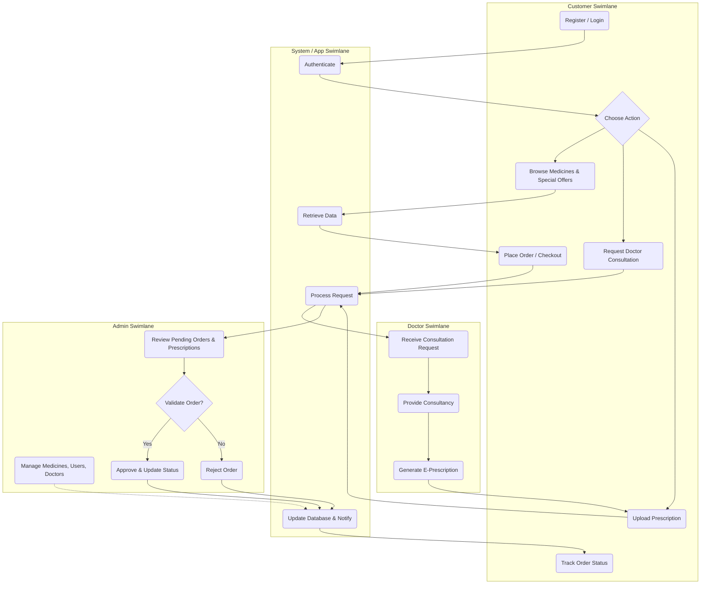
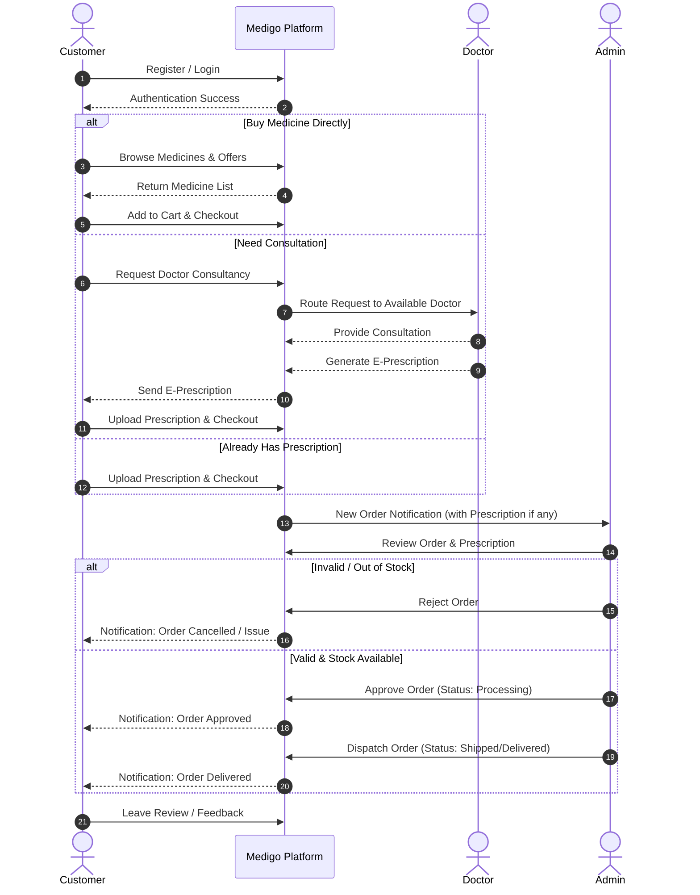

# Medigo E-Pharmacy System Diagrams

Based on the project structure and features, here are two diagrams that illustrate the system's workflows: a Cross-Functional Swimlane Diagram (showing responsibilities) and a Sequence Diagram (showing the interaction over time).

## 1. Cross-Functional Flowchart (Swimlane Diagram)

This diagram shows the responsibilities of each actor (Customer, System, Doctor, Admin) grouped into swimlanes.

## 2. Main Process Sequence Diagram

This diagram visualizes the timeline of actions and interactions between the different actors during the core "Order & Consultation" process.

